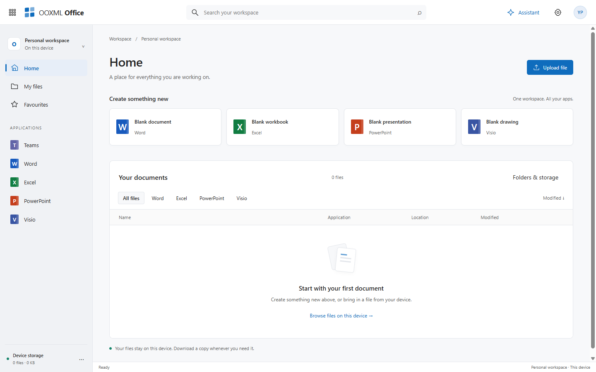

<div align="center">

# OOXML Office

**Word, Excel, PowerPoint, Visio and OpenTeams in one local-first workspace, in the browser or on the desktop.**

[**Open the app**](https://christophervr.github.io/ooxml/) &nbsp;&middot;&nbsp;
[**Suite overview**](../../.github/README.md#ooxml-office-the-whole-suite-in-one-app) &nbsp;&middot;&nbsp;
[**Integration and limits**](../../docs/suite-integration.md) &nbsp;&middot;&nbsp;
[**Desktop**](../../desktop/README.md)



</div>

The deployable Office application workspace (`ooxml-office`), shared by the integrated suite, the standalone PWAs and the desktop package. It mounts the real editors directly, with no demo iframes. Format logic stays in [`ooxml-core`](../../src/core#readme) and reusable controls in [`ooxml-ui`](../../src/ui#readme); this package only wires them together.

## Two ways to open it

The first visit asks what to open:

- **OOXML Office**: every app in one workspace, with a shared library, a tab per open document, the app launcher, search and the assistant.
- **One product on its own**: [Word](../../viewers/docx#readme), [Excel](../../viewers/xlsx#readme), [PowerPoint](../../viewers/pptx#readme), [Visio](../../viewers/visio#readme) or [Teams](../../viewers/teams#readme), each on its own site with its documentation and framework demos.

## Run it

From the repository root:

```sh
bun install
bun run build:suite
bun run preview:suite
```

Output: `suite-dist/`. The root installs Office; `apps/word/`, `apps/excel/`, `apps/powerpoint/`, `apps/visio/` and `apps/teams/` each install independently. They share local profiles and documents when served from the same origin. Installation is available from the account menu or the browser's install command.

See [integration and limitations](../../docs/suite-integration.md) and [desktop packaging](../../desktop/README.md). This is a private application package, not an npm-published library. Cloud identity, cloud drive and document coauthoring are separate integration work.
