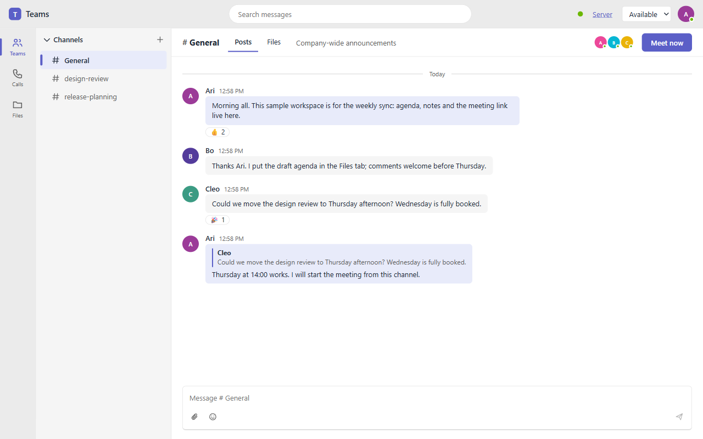
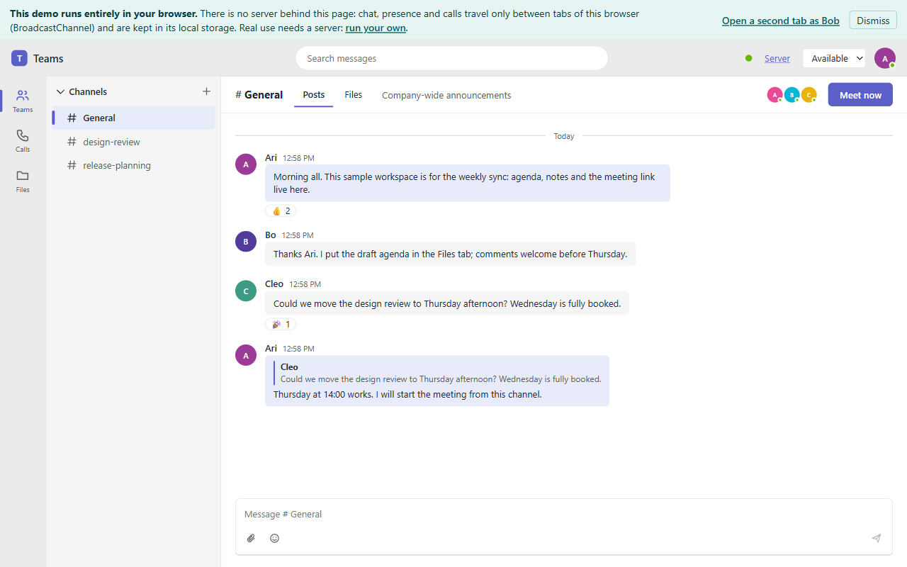
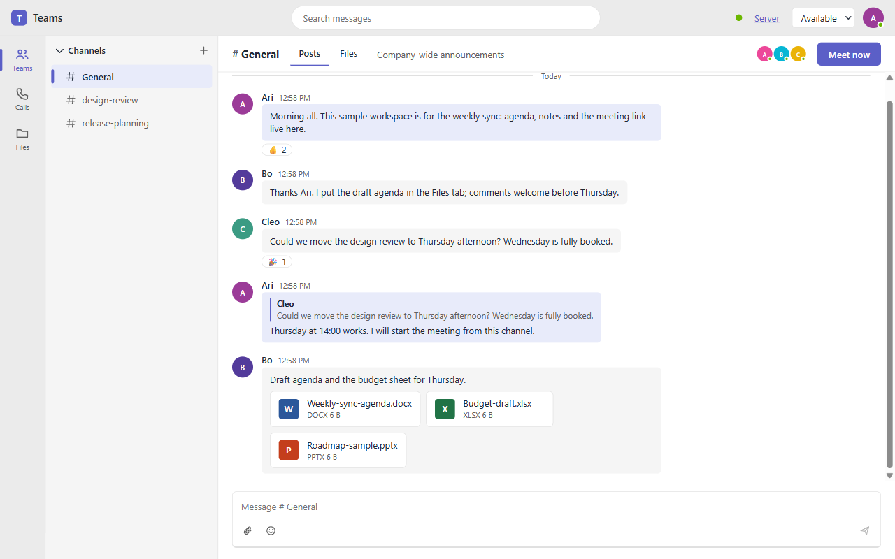
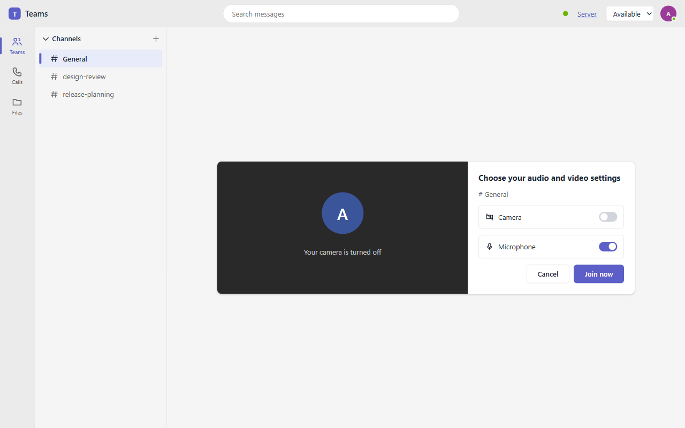

<div align="center">

# OpenTeams

[](https://www.npmjs.com/package/openteams-react-viewer)
[](https://github.com/ChristopherVR/ooxml/blob/main/viewers/teams/LICENSE)
[](https://www.npmjs.com/package/openteams-react-viewer)

**An open-source, bring-your-own-server team workspace: channels and chat, presence and WebRTC meetings, one web component and thin adapters for your framework.**
An early implementation: not Microsoft Teams, not affiliated with Microsoft, and no end-to-end encryption.

[](https://christophervr.github.io/ooxml/teams/)
[](LICENSE)
[](https://github.com/ChristopherVR/ooxml/actions/workflows/ci.yml)

[**Live demo**](https://christophervr.github.io/ooxml/teams/demo/) &nbsp;&middot;&nbsp;
[**Documentation**](https://christophervr.github.io/ooxml/teams/) &nbsp;&middot;&nbsp;
[**Getting started**](#getting-started) &nbsp;&middot;&nbsp;
[**Packages**](#packages)

Part of [ooxml](https://github.com/ChristopherVR/ooxml#readme): [Office](https://github.com/ChristopherVR/ooxml#ooxml-office-the-whole-suite-in-one-app) &middot; [Word](https://github.com/ChristopherVR/ooxml/tree/main/viewers/docx#readme) &middot; [Excel](https://github.com/ChristopherVR/ooxml/tree/main/viewers/xlsx#readme) &middot; [PowerPoint](https://github.com/ChristopherVR/ooxml/tree/main/viewers/pptx#readme) &middot; [Visio](https://github.com/ChristopherVR/ooxml/tree/main/viewers/visio#readme) &middot; **[OpenTeams](https://github.com/ChristopherVR/ooxml/tree/main/viewers/teams#readme)** &middot; [Core](https://github.com/ChristopherVR/ooxml/tree/main/src/core#readme)



</div>

## Why OpenTeams?

- **Your server, your data.** No hosted service: run the small reference server (`openteams-server`) or any server that speaks three documented contracts (y-websocket sync, a JSON signaling relay, optional file storage).
- **One app, every framework.** A Lit `<teams-app>` element owns the UI. React, Vue, Angular, Svelte, Solid and vanilla bindings only handle lifecycle and events, and each also exposes a raw hook so you can build your own UI.
- **Logic in one place.** Chat, presence, calls and the client store live in [`ooxml-core/teams`](https://github.com/ChristopherVR/ooxml/blob/main/docs/teams-area.md), the visual primitives in [`ooxml-ui`](https://github.com/ChristopherVR/ooxml/tree/main/src/ui). This repository holds the app, the bindings, the reference server and the demos.
- **Honest limits.** What is not supported is written down, not hidden. See [limitations](https://christophervr.github.io/ooxml/teams/limitations).

## Features and limitations

|                           |                                                                                                                                                                                                                                                                                                  |
| ------------------------- | ------------------------------------------------------------------------------------------------------------------------------------------------------------------------------------------------------------------------------------------------------------------------------------------------ |
| **Channels and chat**     | Channels, posts with replies, reactions, author-only edit and delete, search and unread counts, in one Yjs document that merges concurrent edits. Everything a peer sends is re-validated and rendered as text, never markup.                                                                    |
| **Presence**              | Who is online, typing, and an availability you set (available, busy, away). Advisory and unauthenticated, like any Yjs awareness.                                                                                                                                                                |
| **Calls**                 | Meetings in a channel over WebRTC: pre-join screen, audio, video, screen share and raise hand. Full mesh with a signaling relay, no media server: honest up to about a dozen people. TURN for strict NATs is yours to run.                                                                       |
| **Files in conversation** | Attachments go to your server's `/files` endpoint or your own `uploadFile` function and are posted as links; Word, Excel, PowerPoint and Visio files are recognised so a host can open them. Without a file server, files are shared by name only.                                               |
| **Server**                | Bring your own. The reference `openteams-server` (one Node process, about 300 lines) does sync, signaling and file storage with an optional shared token, an origin allowlist and short-lived signed download links.                                                                             |
| **Local mode**            | `mode: 'local'` needs no server: tabs of one browser share chat, presence and calls over `BroadcastChannel`. The live demos run this way.                                                                                                                                                        |
| **Not supported**         | No end-to-end encryption (your server can read chat and files). No user accounts in the reference server (one shared token); authorization is the server's job. No 1:1 chats, notifications, calendar, recording, background blur or live captions. No localization yet: the UI is English only. |

## How it works

1. **Start a workspace.** Open the [in-browser demo](https://christophervr.github.io/ooxml/teams/demo/) (no server: it says so at the top), or run `npx openteams-server` and point the app at `ws://127.0.0.1:8787/sync` and `/signal`.

   

2. **Open a second tab as someone else.** The notice's link (or `?name=Bob`) opens the same workspace as another person; in server mode, any browser that reaches your server can join.
3. **Talk.** Post in a channel, reply, react, and attach files. Each message is a Yjs update that reaches the other tabs (local mode) or every client of the room (server mode).

   

4. **Meet.** **Meet now** opens the pre-join screen (camera and microphone toggles); **Join now** connects everyone in the channel's call peer to peer, with signaling relayed by the server (or `BroadcastChannel` locally).

   

## Getting started

### 1. Install

```bash
npm install openteams-react-viewer      # or -vue-, -angular-, -svelte-, -solid-, -vanilla-viewer
npx openteams-server                    # the reference server on 127.0.0.1:8787 (Node 22+)
```

Each binding is self-contained (the `<teams-app>` element is bundled in) and installs [`ooxml-core`](https://www.npmjs.com/package/ooxml-core) and [`ooxml-ui`](https://www.npmjs.com/package/ooxml-ui) as regular dependencies. Use one binding per page: each registers the same custom elements.

### 2. Mount the workspace

```tsx
import { Teams } from 'openteams-react-viewer';

const config = {
	mode: 'server' as const,
	syncUrl: 'wss://teams.example.com/sync',
	signalingUrl: 'wss://teams.example.com/signal',
	iceServers: [{ urls: 'stun:stun.example.com:3478' }],
};

export function Workspace() {
	return <Teams workspaceId="acme" userName="Ada" config={config} />;
}
```

Or build your own UI over the raw hook (state in, plain actions out):

```tsx
const { client, state } = useTeams({ workspaceId: 'acme', user, config });
state?.channels.map((c) => <button onClick={() => client!.select(c.id)}>{c.name}</button>);
```

<details>
<summary><strong>Vanilla JavaScript</strong></summary>

```ts
import { mountTeams } from 'openteams-vanilla-viewer';

const teams = mountTeams(document.getElementById('teams')!, {
	workspaceId: 'acme',
	userName: 'Ada',
	config,
	onOpenFile: (detail) => console.log(detail.attachment.kind, detail.url),
});
teams.destroy();
```

Or plain markup after `defineTeamsApp()`:

```html
<teams-app
	workspace-id="acme"
	user-name="Ada"
	server-config='{"mode":"server","syncUrl":"wss://teams.example.com/sync","signalingUrl":"wss://teams.example.com/signal","iceServers":[{"urls":"stun:stun.example.com:3478"}]}'
></teams-app>
```

</details>

| Binding  | Component                       | Raw hook                                                 |
| -------- | ------------------------------- | -------------------------------------------------------- |
| React    | `<Teams />`                     | `useTeams(options)` (`useTeamsClient`, `useTeamsState`)  |
| Vue 3    | `<Teams />`                     | `useTeams(() => options)` returns shallow refs           |
| Solid    | `Teams(props)`                  | `createTeamsClient(() => options)` returns signals       |
| Svelte 5 | `Teams.svelte` (default export) | `teamsStore(options)` from `/runtime` (a readable store) |
| Angular  | `<teams-workspace>`             | `TeamsService` (signals)                                 |
| Vanilla  | `mountTeams(el, props)`         | `createTeams(options)`                                   |

See the [framework guides](https://christophervr.github.io/ooxml/teams/frameworks/react) and `demos/teams/react/src/App.tsx` for both styles side by side.

### 3. Run the reference server

```bash
npx openteams-server
TEAMS_TOKEN=change-me TEAMS_ORIGINS=https://app.example.com TEAMS_DATA=/var/lib/openteams npx openteams-server
```

It is configured by environment only (`PORT`, `HOST`, `TEAMS_TOKEN`, `TEAMS_ORIGINS`, `TEAMS_DATA`) and serves `ws /sync/<room>`, `ws /signal/<room>`, `POST|GET /files/<workspace>/<name>`, `POST /files/link/<workspace>/<name>` and `GET /health`. Put it behind TLS. See [bring your own server](https://christophervr.github.io/ooxml/teams/server) for the contracts and what it does not do, and [docs/deploy.md](docs/deploy.md) for TLS, tokens, TURN and Docker.

## Packages

Seven packages are published on npm, each versioned independently. The names are `openteams-*` because the plain `openteams` name on npm belongs to an unrelated project.

| Package                    | What it is                                                             | Peer dependency |
| -------------------------- | ---------------------------------------------------------------------- | --------------- |
| `openteams-react-viewer`   | React 18+ component and hooks (`packages/react`).                      | `react`         |
| `openteams-vue-viewer`     | Vue 3.4+ component and composable (`packages/vue`).                    | `vue`           |
| `openteams-angular-viewer` | Angular 17+ standalone component and service (`packages/angular`).     | `@angular/core` |
| `openteams-svelte-viewer`  | Svelte 5 component and store (`packages/svelte`).                      | `svelte`        |
| `openteams-solid-viewer`   | SolidJS 1.9 component and primitive (`packages/solid`).                | `solid-js`      |
| `openteams-vanilla-viewer` | `mountTeams` and the plain `<teams-app>` element (`packages/vanilla`). | none            |
| `openteams-server`         | The reference server and its `openteams-server` command (`server`).    | none (Node 22+) |

The workspace also holds **private** packages that are never published: `teams-viewer` (`packages/web-component`, the `<teams-app>` element, inlined into every binding at build time) and the demos.

```
packages/web-component   <teams-app> (Lit: teams-app.ts + teams-app.css), the controller, the raw store
packages/{react,vue,solid,svelte,angular,vanilla}   thin bindings: a component AND raw hooks each
server/                  reference BYO server: Yjs sync + signaling relay + file storage (~300 lines)
demos/{vanilla,react}    run against your local ooxml checkout, hot reload
docs/                    the VitePress site and the GitHub Pages build (separate install)
```

## Development

Needs Node 22+ and Bun. With the [`ooxml`](https://github.com/ChristopherVR/ooxml) repository checked out next to this one (`../ooxml-core`), the demos and tests use its source; without it they use the published `ooxml-core` and `ooxml-ui`.

```bash
bun install
bun run dev            # reference server :8787, vanilla demo :5173, React demo :5174
bun run typecheck      # strict; the web component and all six bindings (.svelte files excepted)
bun run test           # vitest (jsdom) then the server's node:test suite
bun run test:scripts   # release planner, publish guards, publish:local, commit and changelog checks
bun run build:packages # dist/ for the six bindings (web component inlined); the server needs no build
bun run check:published && bun run pack:smoke
bun install --cwd docs && bun run build:pages   # the docs site and both demos, as deployed
bun run docs:dev       # the docs site with hot reload
```

Open `http://127.0.0.1:5173/?name=Ada` and, in another tab, `...?name=Bob`: two people in one workspace. `?local=1` runs without the server. `TEAMS_USE_DIST=1` makes the demos use the built packages (`bun run build:packages` first) and the published ooxml packages instead of any source. Cameras and microphones need `localhost` or HTTPS.

## Releasing

Releases are automated from Conventional Commits: each package has its own version and tag (`<npm-name>@<version>`), and the hourly release workflow plans, tags and publishes through npm trusted publishing. See [docs/releasing.md](docs/releasing.md) and [CONTRIBUTING.md](../../CONTRIBUTING.md).

## Documentation

[Getting started](https://christophervr.github.io/ooxml/teams/getting-started) &middot; [Architecture](https://christophervr.github.io/ooxml/teams/architecture) &middot; [Framework guides](https://christophervr.github.io/ooxml/teams/frameworks/react) &middot; [Bring your own server](https://christophervr.github.io/ooxml/teams/server) &middot; [Deploying](https://christophervr.github.io/ooxml/teams/deploy) &middot; [Limitations](https://christophervr.github.io/ooxml/teams/limitations) &middot; [Live demos](https://christophervr.github.io/ooxml/teams/demos)

## Contributing and license

Contributions follow [CONTRIBUTING.md](../../CONTRIBUTING.md). [Apache License 2.0](LICENSE); see [`NOTICE`](NOTICE) for attributions.
